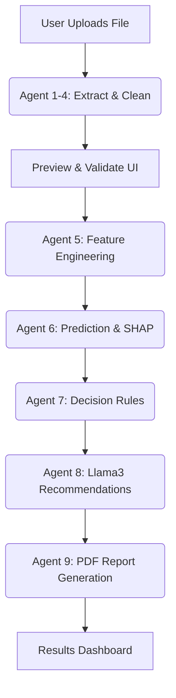

# Manufacturing Analytics

## Overview
The Agentic AI-Based API Batch Quality Evaluation System is a predictive quality assurance platform for pharmaceutical tablet manufacturing. It acts as an intelligent decision-support system by taking raw manufacturing process parameters from uploaded documents (CSV, Excel, Word) and predicting the final quality status of a batch before physical lab tests are completed.

## Problem Statement
Pharmaceutical manufacturing requires strict adherence to Good Manufacturing Practices (GMP). Quality Assurance (QA) professionals traditionally spend significant time manually reviewing physical and chemical process parameters to approve, rework, or reject a batch. Delays in identifying deviations can lead to massive material waste and production bottlenecks.

## Solution
This application implements an automated, file-based pipeline orchestrating 9 AI and data processing agents. It reads multi-format batch files, cleans and engineers the data, applies an XGBoost predictive model, provides visual SHAP explainability, and utilizes a local Large Language Model (Llama 3 via Ollama) to generate immediate Corrective and Preventive Action (CAPA) plans. Finally, it compiles a complete, downloadable PDF Quality Control report.

## Key Features
* **Multi-Format File Processing:** Upload data in `.csv`, `.xlsx`, or `.docx` formats.
* **9-Agent AI Pipeline:** A fully modular agent architecture handling extraction, validation, cleaning, prediction, and reporting.
* **XGBoost Quality Prediction:** Predicts whether a batch should be `Approved`, sent for `Rework`, or `Rejected`.
* **Local SHAP Explainability:** Generates local feature-importance plots (SHAP) for every batch, making the AI's decision transparent to QA reviewers.
* **Generative AI CAPA Plans:** Uses local `llama3` to dynamically generate contextual recommendations and investigation steps based on the top contributing features of a failing batch.
* **Automated PDF QC Reports:** Generates fully formatted, downloadable Quality Control reports via ReportLab.
* **Interactive React Dashboard:** A modern UI to manage file uploads, view historical processing jobs, and inspect deep prediction details.

## System Workflow
The system processes data in a two-phase workflow:

**Phase 1: Upload & Preview**
Input File → FileReader Agent → Extraction Agent → Validation Agent → Cleaning Agent → (Returns Data Preview to User)

**Phase 2: Process & Predict**
Cleaned Data → Feature Engineering Agent → Prediction Agent (XGBoost + SHAP) → Decision Agent → Recommendation Agent (Ollama) → Report Agent → (Saves to DB & Returns Results)



## System Architecture

```mermaid
flowchart LR    
    group frontend(Cloud)[Frontend UI]
    service react(Internet)[React / Vite] in frontend
    
    group backend(Server)[FastAPI Backend]
    service api(Server)[Uvicorn] in backend
    service db(Database)[SQLite Database] in backend
    service models(Disk)[XGBoost Models] in backend
    service ollama(Disk)[Ollama / Llama3] in backend
    
    react:R --> L:api
    api:R --> L:db
    api:T --> B:models
    api:B --> T:ollama
```

## AI / ML Components

### 1. XGBoost Predictive Model
* **Model Name:** `best_model.joblib`
* **Purpose:** Classifies the pharmaceutical batch quality.
* **Input:** 74 engineered process and material features (e.g., hardness, compression force, impurity).
* **Output:** Class prediction (`Approved`, `Rework`, `Rejected`) and probability scores.
* **Usage:** Used by the Prediction Agent (Agent 6) to evaluate batch parameters.

### 2. SHAP Explainer
* **Purpose:** Provides local interpretability for the XGBoost model.
* **Input:** Engineered feature vector.
* **Output:** A generated PNG plot showing the top features pushing the prediction toward or away from approval.
* **Usage:** Generated automatically during the prediction phase.

### 3. Generative CAPA Agent (Llama 3)
* **Model Name:** `llama3` (Running locally via Ollama)
* **Purpose:** Generates Prescriptive Corrective and Preventive Action (CAPA) plans.
* **Input:** The batch decision status and top SHAP feature contributors.
* **Output:** Structured JSON containing a recommendation, corrective actions, and investigation steps.
* **Usage:** Called by the Recommendation Agent (Agent 8) via HTTP request to `http://localhost:11434`.

## Dataset
* **Source:** Based on industrial pharmaceutical manufacturing data sourced from Figshare (*Žagar, A., & Mihelič, J. (2022). Scientific Data*).
* **Files:** `Process.csv`, `Laboratory.csv`, `Normalization.csv`.
* **Details:** Includes batch sensor readings, compression forces, and active pharmaceutical ingredient (API) metrics. Target labels were synthetically engineered for modeling.
* **Usage:** The dataset was used to train the included XGBoost models. You can upload subsets of this data using the UI for testing.

## Project Structure
```text
/
├── backend/
│   ├── agents/               # 9 Distinct Agent classes
│   ├── ml/                   # Data pipeline, labeling, and training scripts
│   ├── routes/               # FastAPI endpoints
│   ├── utils/                # PDF generator
│   ├── config.py             # App configuration
│   ├── database.py           # SQLite setup
│   ├── main.py               # FastAPI entrypoint
│   └── models_db.py          # SQLAlchemy ORM models
├── frontend/
│   ├── src/
│   │   ├── components/       # React UI components
│   │   ├── pages/            # View routing
│   │   └── services/         # API fetch layer
│   ├── package.json
│   └── vite.config.js
├── models/                   # Pre-trained XGBoost, scaler, and label encoders
├── reports/generated/        # Output directory for PDFs and SHAP PNGs
├── run.bat                   # Windows startup script
├── requirements.txt          # Python dependencies
└── pharma_qc2.db             # Application database
```

## Technologies Used
* **Backend:** Python 3.10+, FastAPI, Uvicorn, SQLAlchemy, SQLite, ReportLab
* **Frontend:** React 18, Vite, React Router, Recharts, Lucide-React
* **Machine Learning:** Scikit-Learn, XGBoost, SHAP, Pandas, NumPy
* **Generative AI:** Ollama (Llama 3)

## Requirements
* Python 3.10+
* Node.js 18+ and npm
* Ollama (Installed globally)

## Installation

1. **Clone the Repository:**
```bash
git clone https://github.com/Hemananth-231801056/manufacfacturing_analytics.git
cd manufacfacturing_analytics
```

2. **Backend Setup:**
```bash
# Create and activate a virtual environment (Optional but recommended)
python -m venv .venv
.venv\Scripts\activate

# Install dependencies
pip install -r requirements.txt
```

3. **Frontend Setup:**
```bash
cd frontend
npm install
cd ..
```

4. **Ollama Setup:**
This project actively queries a local LLM to generate recommendations. You must install Ollama and pull the required model.
```bash
# Start the Ollama server in the background, then pull the model:
ollama pull llama3
```

## Running the Application

### Option 1: Automated Script (Windows)
If you are on Windows, simply double-click the `run.bat` file in the root directory. It will open three terminal windows automatically for the backend, frontend, and Ollama.

### Option 2: Manual Startup (Requires 3 Terminals)

**Terminal 1: Start Backend**
```bash
python -m uvicorn backend.main:app --host 0.0.0.0 --port 8000 --reload
```

**Terminal 2: Start Frontend**
```bash
cd frontend
npm run dev
```

**Terminal 3: Start Ollama Server**
```bash
ollama serve
```

Once running, access the web interface at: `http://localhost:5173`

## API Endpoints
The backend runs at `http://localhost:8000`. Key endpoints:
* `POST /api/upload`: Phase 1 upload and extraction preview.
* `POST /api/process/{document_id}`: Phase 2 ML processing, SHAP generation, and LLM CAPA reporting.
* `GET /api/documents`: List uploaded history.
* `GET /api/predictions/{id}`: Get specific batch details.
* `GET /api/reports/{id}/download`: Download the generated QC PDF report.

## Frontend Pages
* `/` (Upload): Drag and drop files to initiate evaluation.
* `/results/:id`: View detailed batch predictions, SHAP plots, and LLM recommendations.
* `/history`: Table showing all past uploaded documents and their success rates.
* `/model`: Overview of the XGBoost architecture and feature importance.

## Model Files
The project includes pre-trained models located in the `models/` directory (`best_model.joblib`, `scaler.joblib`, `label_encoder.joblib`). **You do not need to train the models yourself to run the application.** The application loads these directly upon startup.

## Testing
The `test_all_10_days.py` script can be used to simulate API traffic by pushing consecutive daily batch files to the server.
```bash
python test_all_10_days.py
```

## Troubleshooting
* **Frontend Error: Not Found:** If Vite proxy fails to connect to the backend, ensure your backend is running on IPv4 (`127.0.0.1:8000`).
* **Connection Refused:** Make sure you did not close the terminal windows running the backend or frontend servers.
* **LLM Fallback Message:** If the Recommendation Agent falls back to standard text instead of dynamic CAPA, ensure `ollama serve` is running and the `llama3` model is downloaded.

## Limitations
* **Standalone Deployment:** The application relies entirely on manual file uploads and is not currently integrated with a real-time MQTT/OPC-UA factory data stream.
* **Synthetic Labels:** Target labels used to train the provided models were synthesized via threshold assumptions for demonstration purposes.

## Future Improvements
* Build an integration layer for real-time IIoT machine sensors.
* Deploy the FastAPI backend and Ollama container to a cloud environment like AWS or GCP.
* Expand the LLM context window to provide document-level insights across thousands of batches simultaneously.

## Author
Hemananth

## Repository
https://github.com/Hemananth-231801056/manufacfacturing_analytics
